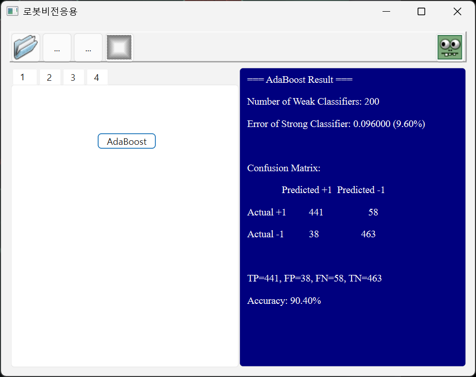

# AdaBoost Coordinate Classifier

10차원 좌표 데이터에 대한 AdaBoost 기반 이진 분류기.
CSV 파일의 1,000개 학습 샘플로부터 Weak Classifier를 순차적으로 결합하여 Strong Classifier를 구성한다.

## Algorithm

### Feature (KFeatureCoord)

10차원 입력 벡터에서 하나의 축(axis)을 선택하여 feature 값으로 사용한다.

```
KFeatureCoord(axis=i) → feature(x) = x[i]
```

- 10개의 feature (X1~X10), 각각 하나의 좌표축에 대응
- 각 라운드에서 가장 판별력 높은 축을 자동 선택

### Weak Classifier (KWeakClassifierCoord)

하나의 feature에 대해 최적의 threshold와 polarity를 결정하여 이진 분류한다.

```
h(x) = +1  if feature(x) * polarity > threshold * polarity
       -1  otherwise
```

**Optimal Threshold 탐색:**

```
1. Feature 값 기준으로 샘플을 오름차순 정렬
2. 양성/음성 샘플의 가중 누적합 (Cp, Cm) 계산
3. 모든 분할점에서 양/음 방향의 가중 오차 계산
4. 최소 오차를 주는 threshold + polarity 선택
```

- Polarity는 threshold의 부호에 포함 (`dThresh > 0 → +1`, `< 0 → -1`)

### Strong Classifier (KStrongClassifierCoord)

여러 Weak Classifier를 가중 결합하여 최종 분류를 수행한다.

```
for t = 1 to T:
  1. 샘플 가중치 정규화 (합 = 1)
  2. 모든 feature에 대해 최적 Weak Classifier 탐색
  3. 가중 오차가 최소인 Weak Classifier 선택
  4. alpha = 0.5 * ln((1 - error) / error)
  5. 맞힌 샘플 가중치 감소, 틀린 샘플 가중치 증가

H(x) = sign(Σ alpha_t * h_t(x))
```

- 최대 200 라운드 (nTmax=200)
- 에러 >= 0.5이면 조기 종료 (랜덤 이하의 분류기 방지)
- 에러 < 1e-10 클램핑으로 log(0) 방지

## 데이터

| 항목 | 설명 |
|------|------|
| 파일 | `data/samples.csv` |
| Feature | X1~X10 (10차원 실수 좌표) |
| Label | CLASS: +1 (양성) / -1 (음성) |
| 샘플 수 | 1,000개 (헤더 제외) |

## 실험 결과

**Confusion Matrix**

|  | Predicted +1 | Predicted -1 |
|--|:-----------:|:-----------:|
| **Actual +1** | 441 (TP) | 58 (FN) |
| **Actual -1** | 38 (FP) | 463 (TN) |

| 항목 | 값 |
|------|-----|
| Weak Classifiers | 200개 |
| Error Rate | 9.60% |
| **Accuracy** | **90.40%** |
| Precision | 92.07% |
| Recall | 88.38% |

- 200개의 Weak Classifier를 결합하여 90.4%의 정확도 달성
- FP(38)보다 FN(58)이 많아 양성 샘플의 분류가 상대적으로 어려움
- 10차원 좌표 데이터에서 축 단위의 단순한 threshold 분류기만으로도 높은 성능을 보여줌



## 파일 구조

| 파일 | 역할 |
|------|------|
| `adaboostPipeline.cpp` / `.h` | CSV 로딩, feature 생성, 혼동행렬 평가 |
| `classifierCoord.cpp` / `.h` | KWeakClassifierCoord, KStrongClassifierCoord 구현 |
| `featureCoord.h` | KFeatureCoord — 축 기반 feature 추출 |
