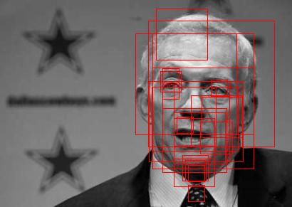
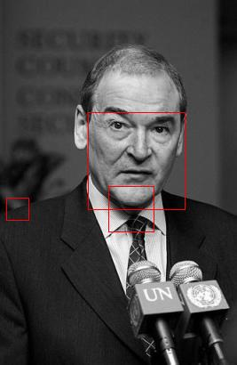
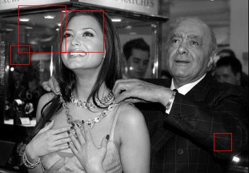
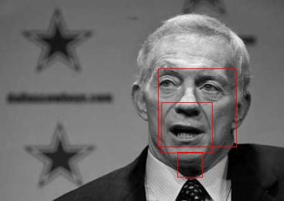

# Viola-Jones Face Detection

Viola-Jones (2001/2004) 논문 기반의 실시간 얼굴 검출 시스템.
AdaBoost cascade classifier를 이용한 multi-scale sliding window 방식으로, FDDB 데이터셋에서 학습하고 테스트 이미지에서 얼굴을 검출한다.

---

## Haar-like Features

24x24 윈도우에서 5종류의 Haar-like feature를 추출하여 얼굴의 밝기 패턴을 수치화한다.

| Feature Type | 구조 | 캡처하는 패턴 |
|-------------|------|-------------|
| 2H (Edge) | `[-][+]` 좌우 분할 | 눈-볼 밝기 차이 |
| 2V (Edge) | `[-]` / `[+]` 상하 분할 | 이마-눈 밝기 차이 |
| 3H (Line) | `[-][+][-]` 3등분 | 코 라인 |
| 3V (Line) | `[-]`/`[+]`/`[-]` 3등분 | 눈-코-입 수직 구조 |
| 4 (Diagonal) | 2x2 체커보드 | 대각선 패턴 |

- 24x24 윈도우에서 총 **162,336개** feature 생성
- Integral Image를 사용하여 O(1)에 각 feature 계산
- **Per-window variance normalization**: 각 윈도우의 stddev로 feature 값을 나누어 조명 불변성 확보

## AdaBoost (Strong Classifier)

162,336개 feature 중 가장 판별력 높은 feature를 순차적으로 선택하여 Strong Classifier를 구성한다.

```
for t = 1 to T:
  1. Weight 정규화
  2. 모든 feature에 대해 최적 threshold + polarity 탐색 → Weak Classifier
  3. 가중 에러가 가장 낮은 Weak Classifier 선택
  4. alpha = ln(1/beta) 계산 (분류기 신뢰도)
  5. 맞힌 샘플 weight 감소 → 다음 라운드에서 어려운 샘플에 집중
```

- **Weak Classifier**: `polarity × featureValue < polarity × threshold → face(1)`
- **Strong Classifier**: `score = Σ(alpha_i × h_i(x))`, `face if score >= detectThreshold`

## Cascade Classifier

여러 stage의 Strong Classifier를 직렬 연결하여 비얼굴을 빠르게 제거한다.

```
입력 윈도우 → [Stage 0] → [Stage 1] → ... → [Stage N] → 얼굴!
                 ↓ reject     ↓ reject              ↓ reject
              비얼굴        비얼굴                 비얼굴
```

- 초반 stage (T=2, 10): 간단한 feature로 명백한 비얼굴 빠르게 제거
- 후반 stage (T=50): 복잡한 feature로 어려운 케이스 정밀 판별
- **Early Rejection**: 하나라도 reject하면 즉시 비얼굴로 판정 → 연산량 대폭 절감

## Multi-scale Sliding Window

학습된 cascade를 이용해 임의 크기의 이미지에서 얼굴을 검출한다.

```
for scale = 1.0, 1.25, 1.5625, ...:
  이미지를 1/scale로 축소
  for each 24x24 window (step=4):
    cascade classify → face/non-face
    face이면 원본 좌표로 변환하여 저장

raw detections → NMS (Non-Maximum Suppression) → 최종 결과
```

---

## 기술적 특징

### 논문 기반 Cascade 학습

Viola-Jones 논문의 3가지 핵심 메커니즘을 구현하였다.

| 항목 | 단순 구현 | 논문 기반 (본 구현) |
|------|----------|-------------------|
| Threshold | 모든 stage `0.5 × alphaSum` (상대값) | stage별 **절대 threshold** — d_min DR 보장하도록 자동 조정 |
| Negative 샘플 | 원본 negative 재사용 → stage 간 중복 | **Hard Negative Mining** — 현재 cascade를 통과한 FP만 수집 |
| 종료 조건 | 고정 stage 수 | 누적 FPR < F_target 시 자동 종료 + hard neg < 10개면 중단 |

### Per-window Variance Normalization

각 24x24 윈도우마다 pixel의 mean과 stddev를 계산하여 Haar feature 값을 정규화한다.

```cpp
dMean = Σ(pixel) / N
dStd  = sqrt(Σ(pixel²)/N - dMean²)
if (dStd < 1.0) dStd = 1.0     // 균일 영역에서 과도한 증폭 방지

// 2-region feature (2H, 2V)
featureValue = (Area(Plus) - Area(Minus)) / dStd

// 3-region feature (3H, 3V) — 비대칭 영역 보정을 위한 mean-correction 포함
featureValue = (Area(Plus) - Area(Minus1) - Area(Minus2) + Size(Minus) * dMean) / dStd
```

- 밝은 영역과 어두운 영역에서 동일한 feature scale 보장
- 학습과 검출 양쪽 모두 동일한 normalization 적용
- 3-region feature는 Plus/Minus 영역 크기가 다르므로, mean 기반 보정항을 추가하여 DC 성분을 제거

### Hard Negative Mining

각 cascade stage 학습 후, 현재 cascade가 잘못 통과시키는 패치(False Positive)를 FDDB 이미지에서 수집하여 다음 stage의 negative 샘플로 사용한다.

```
FDDB 2,835장 순회:
  이미지당 랜덤 24x24 패치 50개 추출
  face bbox와 IoU > 0.1이면 스킵
  현재 cascade로 classify → face 판정 = FP = hard negative
  최대 1,500개 수집
```

- Stage가 깊어질수록 어려운 negative만 남아 classifier가 점진적으로 강화됨
- Hard negative가 10개 미만이면 cascade FPR이 충분히 낮다고 판단하여 학습을 종료

### Non-Maximum Suppression (NMS)

Sliding window에서 발생하는 중복 detection을 그룹화하여 하나의 박스로 합친다.

```
1. 겹치는 detection을 IoU > 0.3 기준으로 그룹핑
2. 그룹 내 detection 수 >= minNeighbors일 때만 유효한 검출로 인정
3. 그룹의 평균 좌표/크기로 최종 박스 생성
```

---

## 데이터

[FDDB (Face Detection Data Set and Benchmark)](http://vis-www.cs.umass.edu/fddb/)를 기반으로 학습 데이터를 구성하고, [Kaggle Face Detection Dataset](https://www.kaggle.com/datasets/ngoduy/dataset-for-face-detection)의 이미지를 validation/test에 사용하였다.

| 용도 | 소스 | 수량 |
|------|------|------|
| Training positive | FDDB face crop → 24x24 | 500개 |
| Training negative | FDDB non-face patch 24x24 (IoU<0.1) | 1,500개 |
| Validation positive | data/positive (24x24) | 40개 |
| Validation negative | data/negative (24x24) | 20개 |
| Test images | data/test | 7장 |
| Hard neg mining pool | FDDB 2,835장 | 이미지당 50 패치 |

---

## 실험 결과

### 파라미터

| 파라미터 | 값 | 설명 |
|---------|-----|------|
| `d_min` | 0.95 | stage별 최소 detection rate |
| `F_target` | 1e-6 | 전체 cascade 목표 FPR |
| `fixedT` | {2, 10, 25, 50, 50, 50} | stage별 weak classifier 수 (최대 6 stages, FPR 도달 시 조기 종료) |
| Window size | 24x24 | 고정 검출 윈도우 |
| Step | 4 pixels | Sliding window 이동 간격 |
| Scale factor | ×1.25 | 이미지 축소 배율 |

### Cascade 학습 결과 (5 stages)

| Stage | T (Weak Classifiers) | detectThreshold | 역할 |
|-------|---------------------|-----------------|------|
| Stage 0 | 2 | 1.433 | 매우 느슨. 명백한 non-face만 제거 |
| Stage 1 | 10 | 3.792 | 실질적 필터링 시작 |
| Stage 2 | 25 | 6.313 | 중간 수준 필터링 |
| Stage 3 | 50 | 10.291 | Hard negative 대상 정밀 판별 |
| Stage 4 | 50 | 14.175 | 최종 stage. 가장 strict한 필터링 |

- Stage 5에서 hard negative < 10개 → cascade FPR 충분히 낮아 자동 종료
- 총 weak classifier 수: 2 + 10 + 25 + 50 + 50 = **137개**

### Validation

|  | Predicted Face | Predicted Non-face |
|--|:-----------:|:-----------:|
| **Actual Face** | 16 (TP) | 24 (FN) |
| **Actual Non-face** | 0 (FP) | 20 (TN) |

| 항목 | 값 |
|------|-----|
| **Accuracy** | **60%** |
| **Precision** | **100%** |
| **Recall (DR)** | **40%** |
| **FPR** | **0%** |

- **FPR=0%**: 비얼굴을 얼굴로 잘못 판별한 경우가 없음
- **DR=40%**: 학습 데이터(FDDB crop)와 검증 데이터(data/positive)의 분포 차이, cascade의 보수적 특성, d_min=0.95의 누적 효과(0.95^5 ≈ 0.77) 등이 원인
- 실제 테스트에서는 multi-scale sliding window를 통해 다양한 크기/위치의 윈도우를 시도하므로, 단일 패치 validation보다 검출 성능이 높게 나타남

### Detection 결과 (data/test 7장)

**NMS 효과 비교**

| Raw Detection (none) | NMS 적용 (n3, minNeighbors=3) |
|:---:|:---:|
|  |  |
|  |  |

**Detection 결과 (n3)**

| | |
|:---:|:---:|
|  |  |
| 다인 이미지 검출 | 모자 착용 얼굴 검출 |
|  |  |
| 정면 얼굴 검출 | 측면 얼굴 (미검출) |

- 정면 얼굴 검출에 성공하며, 다인 이미지도 처리 가능
- 일부 FP 존재 (작은 비얼굴 영역에 박스)
- minNeighbors가 높을수록 FP 감소, 약한 검출도 함께 감소
- 측면/기울어진 얼굴은 검출이 어려움 (학습 데이터가 주로 정면)

---

## 파일 구조

| 파일 | 역할 |
|------|------|
| `adaboost.cpp` / `.h` | AdaBoost, WeakClassifier, Haar feature 추출 |
| `cascade_classifier.cpp` / `.h` | CascadeClassifier (논문 기반 cascade 학습) |
| `detection_utils.cpp` / `.h` | IoU, NMS(groupDetections), drawRedBox, detectMultiScale |
| `fddb_utils.cpp` / `.h` | QImage→KImageGray 변환, FDDB 라벨 파싱, 샘플 추출 |
| `model_io.cpp` / `.h` | cascade 모델 저장/로드 |
