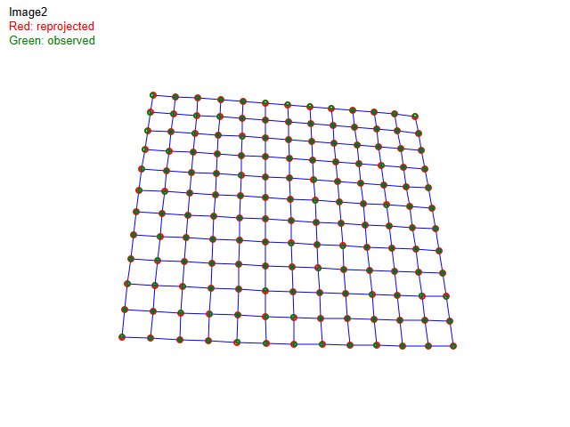
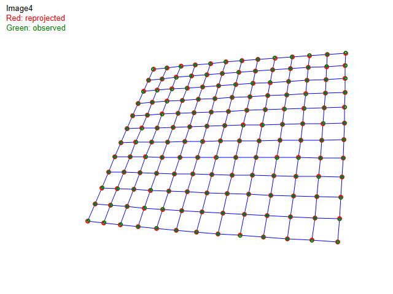
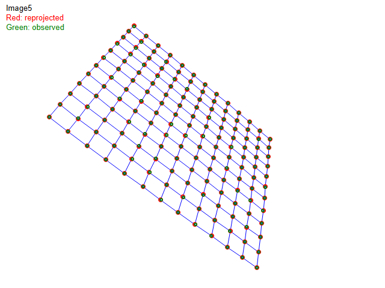
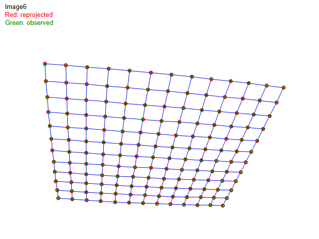
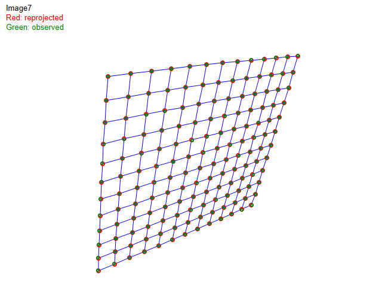

# Zhang's Camera Calibration

Zhang(2000) 논문 기반 카메라 캘리브레이션.
7장의 체커보드 이미지(각 156개 코너점)로부터 카메라 내부 파라미터와 렌즈 왜곡 계수를 추정하고, 재투영으로 성능을 검증한다.

---

## Homography 추정 (DLT + SVD)

각 체커보드 이미지에서 모델 좌표(Z=0 평면)와 이미지 좌표 간의 호모그래피 H를 추정한다.

```
모델점 (X, Y) → 이미지점 (u, v)

H = [h1 h2 h3], 3x3 행렬
s·[u v 1]^T = H · [X Y 1]^T
```

- DLT(Direct Linear Transform)로 선형 방정식 구성 → SVD로 풀기
- **좌표 정규화**: 모델/이미지 좌표를 각각 평균=0, 평균거리=sqrt(2)로 변환하여 수치 안정성 확보
- 7장의 이미지에서 7개의 H를 각각 추정

## 내부 파라미터 추출

H로부터 카메라 내부 행렬 A를 closed-form으로 계산한다.

```
B = λ · A^{-T} · A^{-1}  (symmetric, 6 unknowns)

제약 조건 (각 이미지마다 2개):
  h1^T · B · h2 = 0           (r1, r2 직교)
  h1^T · B · h1 = h2^T · B · h2  (||r1|| = ||r2||)

7장 → 14개 방정식 → Vb = 0 (14x6)을 SVD로 풀어서 B 복원 → A 추출
```

- skew = 0 가정 (gamma = 0). B의 6개 원소를 모두 풀면 B12 ≈ 0이 자연스럽게 도출됨
- B로부터 alpha, beta, u0, v0를 해석적으로 계산

## 외부 파라미터 추출

각 이미지의 카메라 자세(R, t)를 추정한다.

```
H = η · A · [r1  r2  t]   (η = scale factor)

r1 = λ · A^{-1} · h1,  λ = 1 / ||A^{-1} · h1||
r2 = λ · A^{-1} · h2
r3 = r1 × r2
t  = λ · A^{-1} · h3
```

- R = [r1 r2 r3]에 SVD 기반 직교화 적용
- 7장의 이미지에서 7세트의 (R, t) 추출

## 비선형 최적화 (Powell's Method)

Closed-form 결과를 초기값으로 하여 재투영 오차를 최소화한다.

```
상태벡터 (48차원):
  [alpha, beta, u0, v0, k1, k2, (euler_angles + t) × 7장]

Error Function:
  Erf = Σ_i Σ_j || m_observed - m_projected ||^2

  m_projected:
    Xc = R · M + t              (월드 → 카메라)
    xn = Xc_x / Xc_z,  yn = Xc_y / Xc_z   (정규화 좌표)
    r² = xn² + yn²
    distortion = 1 + k1·r² + k2·r⁴
    u = alpha · xn · distortion + u0
    v = beta  · yn · distortion + v0
```

- Powell's Method: gradient 없이 방향 벡터를 갱신하며 최소화
- Line minimization: Golden Section Search + Brent's Method
- k1, k2 초기값 = 0 (closed-form에서는 왜곡 미고려)

---

## 데이터

| 항목 | 설명 |
|------|------|
| 모델 좌표 | `data/hw03/model.txt` — 12x13 체커보드 코너점 (X, Y), 100mm 간격 |
| 이미지 좌표 | `data/hw03/Image1~7.txt` — 각 이미지 156개 코너점 (u, v) |
| 이미지 수 | 7장 |
| 코너점 수 | 156개/장 (12열 x 13행), 총 1,092개 |

---

## 결과

### Closed-form vs 최적화 후 비교

| 파라미터 | Closed-form | Powell 최적화 후 | 설명 |
|---------|-------------|-----------------|------|
| fx (alpha) | 655.84 | 656.78 | x축 초점거리 (pixel) |
| fy (beta) | 662.02 | 663.78 | y축 초점거리 (pixel) |
| u0 | 321.64 | 320.65 | 주점 x좌표 (pixel) |
| v0 | 252.06 | 251.68 | 주점 y좌표 (pixel) |
| k1 | 0 | -0.2317 | 방사 왜곡 계수 1 |
| k2 | 0 | 0.0409 | 방사 왜곡 계수 2 |

### 최적화 수렴

| 항목 | 값 |
|------|-----|
| Initial Erf | 10714.1 |
| Final Erf | 108.66 |
| **RMS Error** | **0.3154 pixel** |
| 반복 횟수 | 최대 50회 (수렴) |

- Closed-form만으로도 양호한 초기 추정 (fx 변화 < 1px, fy 변화 약 1.8px)
- 처음 9회 반복에서 Erf가 98.3% 감소 (10714 → 184.6), 이후 미세 수렴
- Powell 최적화로 렌즈 왜곡 보정을 추가하여 RMS 0.32px 달성
- k1 < 0: 배럴 왜곡 (barrel distortion), k2 > 0: 고차 보정


---

## 시각화 검증

캘리브레이션으로 추정한 파라미터(A, R, t, k1, k2)를 이용하여 모델 좌표를 이미지 평면에 재투영하고, 실제 관측값과 비교하였다.

```
재투영 과정:
  월드 좌표 (model.txt) → R, t 적용 → 정규화 → 왜곡 적용 (k1, k2) → 픽셀 좌표

비교 대상:
  - Reprojected (빨간 점): 위 과정으로 계산한 투영 좌표
  - Observed (초록 점): 실제 이미지에서 검출된 코너 좌표 (ImageN.txt)
```

- **파란 격자선**: 재투영 포인트를 12x13 그리드로 연결하여 체커보드 패턴 시각화
- **빨간 점**: 재투영 좌표 (캘리브레이션 모델의 예측값)
- **초록 점**: 관측 좌표 (실제 코너 위치)

| | |
|:---:|:---:|
|  |  |
| Image 1 | Image 2 |
|  |  |
| Image 3 | Image 4 |
|  |  |
| Image 5 | Image 6 |
|  | |
| Image 7 | |

7장 모두에서 빨간 점과 초록 점이 거의 완전히 겹치며, 이미지 가장자리에서도 격자 왜곡이 자연스러워 k1, k2의 방사 왜곡 모델이 적절히 동작함을 확인할 수 있다.

---

## 파일 구조

| 파일 | 역할 |
|------|------|
| `zhangCalibration.cpp` / `.h` | 호모그래피 추정, B행렬/내부파라미터/외부파라미터 추출, Erf() 재투영 오차 함수 |
| `zhangVisualization.cpp` / `.h` | 재투영 그리드 시각화, 이미지 PNG 저장 |
| `zhang_calibration.cpp` / `.h` | Zhang 캘리브레이션 래핑 — 데이터 로딩, 파이프라인 실행, 결과 출력 |
