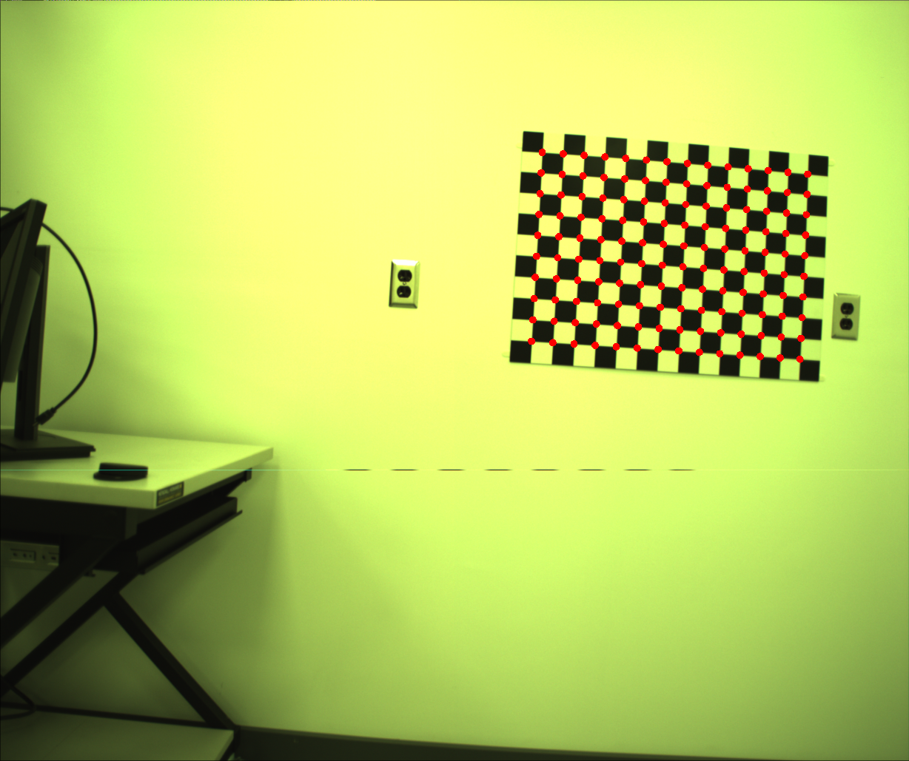
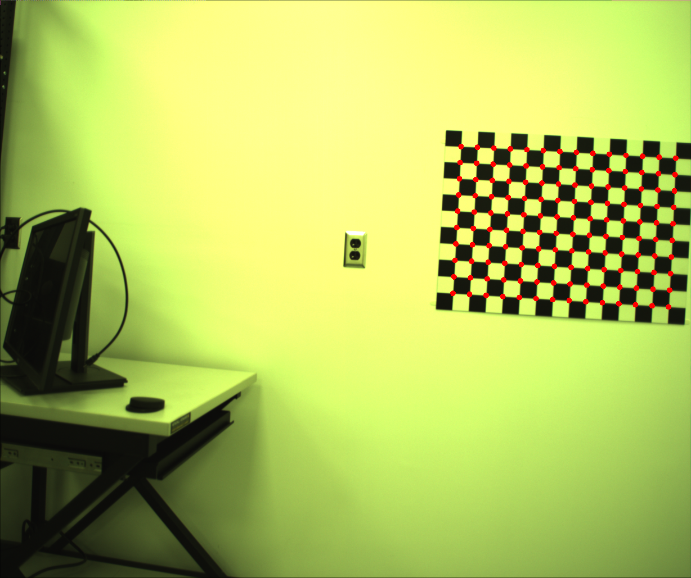
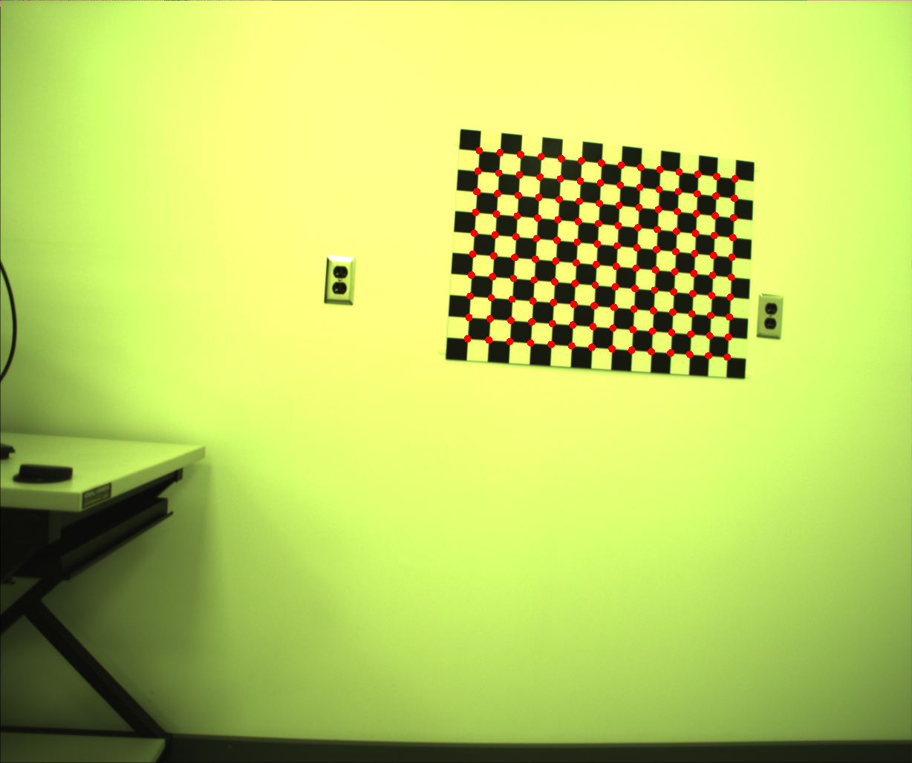
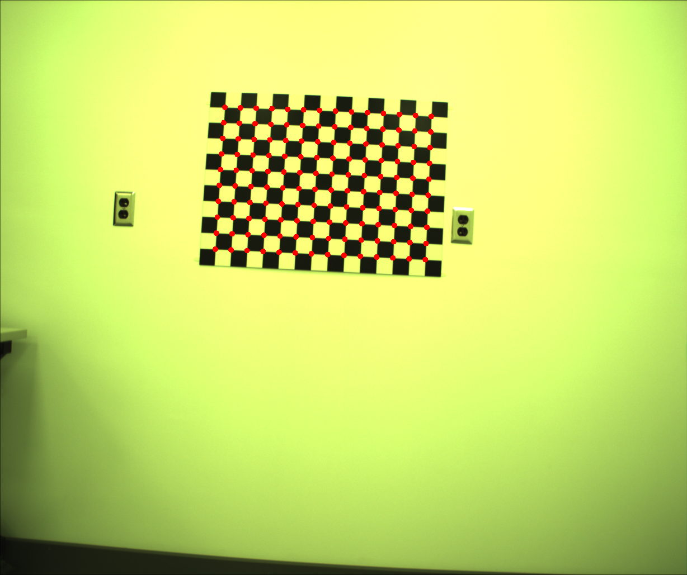
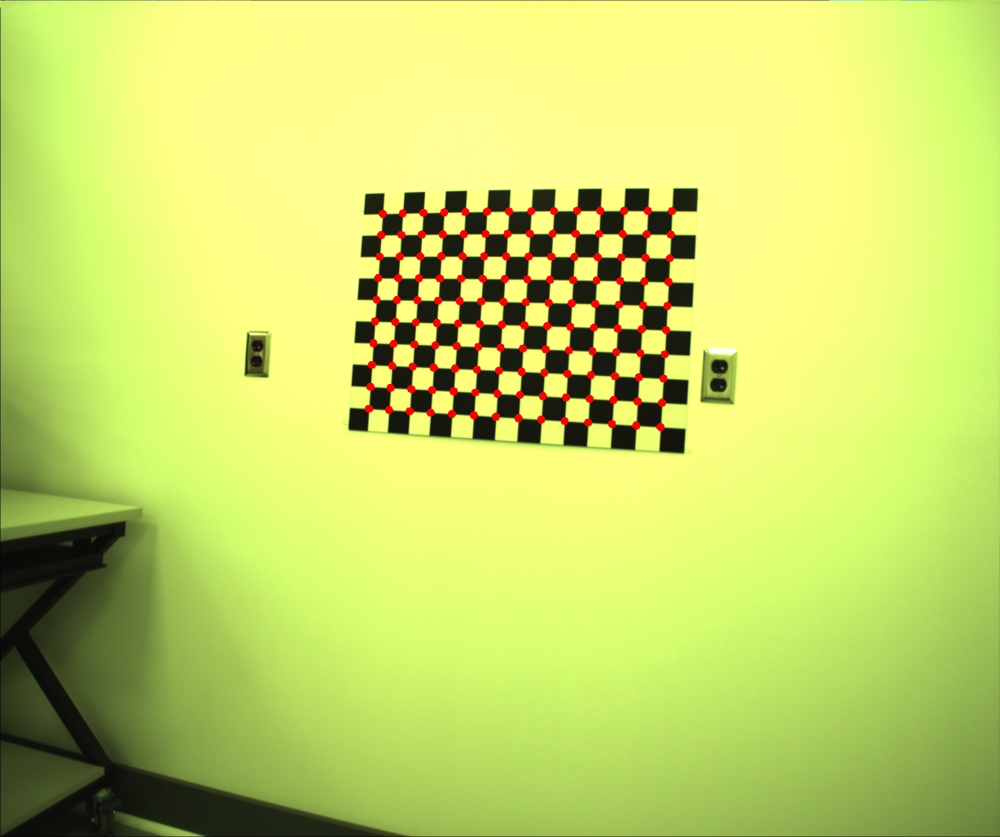

# Hand-Eye Calibration

Denso VS-6577GM-B 로봇 + JAI BB-500 카메라 시스템에서 Hand-Eye Calibration을 수행한다.
15개 로봇 pose에서 촬영한 체커보드 이미지로부터 EE→카메라 변환(Z)과 패턴의 월드 좌표(W)를 추정하고, Three.js 3D 시각화로 검증한다.

---

## 파이프라인

```
[Step 1] Corner Detection ─── OpenCV findChessboardCorners + cornerSubPix
   14/15 hand-eye, 39/42 internal 검출 성공
         ↓
[Step 2] Camera Calibration ── Zhang's Method (39장)
   K = [970.1, 968.0, 603.0, 493.7], k1=-0.006, k2=-0.005
         ↓
[Step 3] Pose Estimation ───── Planar PnP (DLT + LM, 왜곡 보정)
   14개 T_cam→pattern 추정 (reproj 0.38~0.56 px)
         ↓
[Step 4] Hand-Eye Calibration ─ AX=XB + AX=ZB + LM + Outlier Rejection
   Z (T_EE→cam), W (T_base→pattern) 추정
         ↓
[Step 5] 3D Visualization ──── Three.js 인터랙티브 시각화
```

## Pose Estimation (Planar PnP)

각 hand-eye 이미지에서 카메라의 절대 pose T_cam→pattern을 추정한다.

```
1) Iterative undistortion: 이미지 좌표를 정규화 → k1, k2 역보정
2) Normalized DLT → Homography H (좌표 정규화로 수치 안정성 확보)
3) [r1 r2 t] = K⁻¹ × H, r3 = r1 × r2, SVD 직교화
4) 양쪽 분해(±r1, ±r2, ±t) 시도 → 더 낮은 reproj error 선택
5) LM refinement — 왜곡 포함 projection: fx·xn·(1+k1·r²+k2·r⁴)+cx
```

## Hand-Eye Calibration (AX=XB + AX=ZB)

회전 추정에는 AX=XB(상대 pose 기반), 평행이동 및 월드 좌표 추정에는 AX=ZB(절대 pose 기반)를 사용한다.

**핵심 방정식:**

```
AX=XB (상대 pose):  ΔA_ij · X = X · ΔB_ij
AX=ZB (절대 pose):  T_base→EE(i) × Z × T_cam→pattern(i) = W   (모든 i에서 일정)
```

| 단계 | Formulation | 방법 | 설명 |
|------|-------------|------|------|
| 회전 Rz | **AX=XB** | Andreff SVD | C(14,2)=91쌍 중 회전각>3°인 65쌍 사용 |
| 월드 회전 Rw | **AX=ZB** | 절대 pose 평균 | Rw = orthogonalize(Σ Rb×Rz×Ra / n) |
| 평행이동 tz, tw | **AX=ZB** | Least Squares | Rb×tz - tw = -(Rb×Rz×ta + tb) |
| 통합 정밀화 | AX=ZB | LM (12 params) | [rvec_z, tz, rvec_w, tw] 동시 최적화 |
| Outlier rejection | — | median × 2.5 | threshold 초과 pose 제거 후 재풀이 |

**AX=XB를 회전에 사용하는 이유:**
상대 pose(차분)는 절대 위치 오차의 영향을 받지 않아 회전 추정이 robust하며, Kronecker 곱 선형화(Andreff SVD)가 회전 부분에서 효과적이다.

**AX=ZB를 평행이동에 사용하는 이유:**
절대 pose에서 평행이동 정보를 직접 활용하여 tz, tw를 동시 추정하며, 세계 좌표계(W)도 함께 복원할 수 있다.

**로봇 pose 컨벤션:**
`robot_cali.txt`는 T_EE→base 형식이므로 역행렬하여 T_base→EE로 변환 후 사용한다. 두 컨벤션 모두 시도하여 더 나은 결과를 자동 선택한다.

---

## 데이터

[USDA Hand-Eye Dataset](https://data.nal.usda.gov/dataset/data-solving-robot-world-hand-eyes-calibration-problem-iterative-methods) (DS5)를 사용하였다.

| 경로 | 내용 | 용도 |
|------|------|------|
| `data/DS5/handeye/image0~14.tiff` | 15장 체커보드 이미지 | Hand-Eye Calibration (PnP) |
| `data/DS5/internal/image0~41.tiff` | 42장 체커보드 이미지 | Camera Calibration (Zhang) |
| `data/DS5/robot_cali.txt` | 15개 로봇 EE pose (T_EE→base) | 로봇-카메라 쌍 매칭 |
| `data/DS5/calibration_object.txt` | 체커보드 사양 (10×14, 52mm) | 모델 좌표 생성 |

### Corner Detection 결과

| Pose 0 | Pose 5 | Pose 10 |
|:------:|:------:|:-------:|
|  |  |  |

| Internal 0 | Internal 20 |
|:----------:|:-----------:|
|  |  |

---

## 결과

### Hand-Eye Transform Z (T_EE→cam)

```
[  0.9969   0.0583  -0.0522 |  121.1 ]
[ -0.0605   0.9973  -0.0426 |  533.9 ]
[  0.0496   0.0456   0.9977 | -140.2 ]
[    0        0        0    |    1   ]
```

### World Transform W (T_base→pattern)

```
[ -0.0357  -0.0021  -0.9994 | -2190.0 ]
[  0.9994  -0.0046  -0.0357 |  -365.7 ]
[ -0.0045  -1.0000   0.0023 |   478.6 ]
[    0        0        0    |     1   ]
```

### 정량 지표

| 항목 | 값 |
|------|-----|
| ||tz|| (EE→카메라 거리) | **565.1 mm** |
| Avg verification error | **7.381** |
| Relative pairs used | 65 / 91 (angle > 3°) |

### Per-pose Verification Error

| Pose | Error | Pose | Error |
|------|-------|------|-------|
| 0 | 9.33 | 7 | 7.99 |
| 1 | 8.02 | 8 | 7.38 |
| 2 | 6.06 | 9 | 4.63 |
| 3 | 1.76 | 10 | 1.82 |
| 4 | 11.73 | 11 | 9.38 |
| 5 | 17.16 | 12 | 2.21 |
| 6 | 8.85 | 13 | 7.03 |

### 비선형 최적화 효과

| 항목 | 최적화 전 | 최적화 후 | 변화 |
|------|----------|----------|------|
| PnP 왜곡 보정 | 미적용 | k1, k2 적용 | — |
| avg_error | 7.79 | **7.38** | -5.3% |
| ||tz|| | 587 mm | **565 mm** | -22 mm |

---

## 시각화 (Three.js)

**[Live Demo](https://wzh-robotics.github.io/robot-vision-app/)** — `visualization/index.html`


- **3D 뷰**: 로봇 base 좌표계, EE 위치(주황 큐브), 카메라 위치(핑크 프러스텀), 체커보드(W 위치)
- **슬라이더**: 15개 pose 탐색 + 자동 재생
- **Info Panel**: EE/카메라 위치, per-pose verification error 실시간 표시
- **사이드바 4탭**: 각 파이프라인 단계별 파라미터/결과 확인

검증 원리: `T_base→EE(i) × Z × T_cam→pattern(i) ≈ W`가 모든 pose에서 동일한 W를 산출하면 캘리브레이션이 성공한 것이며, 3D 뷰에서 모든 카메라가 동일한 체커보드를 가리키는 것으로 확인할 수 있다.

---

## 파일 구조

| 파일 | 역할 |
|------|------|
| `corner_detection.cpp` / `.h` | OpenCV 기반 체커보드 코너 검출 |
| `camera_calibration.cpp` / `.h` | Zhang's Calibration 래핑, 결과 저장/로드 |
| `pose_estimation.cpp` / `.h` | Planar PnP (DLT + LM, 왜곡 보정), 변환 행렬 I/O |
| `handeye_calibration.cpp` / `.h` | AX=XB + AX=ZB + LM + outlier rejection |
| `axxbsolver.h` | AX=XB solver 추상 클래스 |
| `conventionalaxxbsvdsolver.cpp` / `.h` | Conventional SVD 기반 AX=XB solver |
| `axxb_utils.cpp` / `.h` | 회전/변환 행렬 유틸리티 (Rodrigues, Kronecker 등) |
| `type.h` | 공통 타입 정의 |
| `visualization/index.html` | Three.js 3D 시각화 (단일 HTML) |
