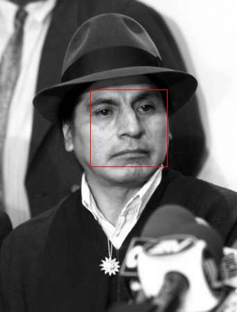
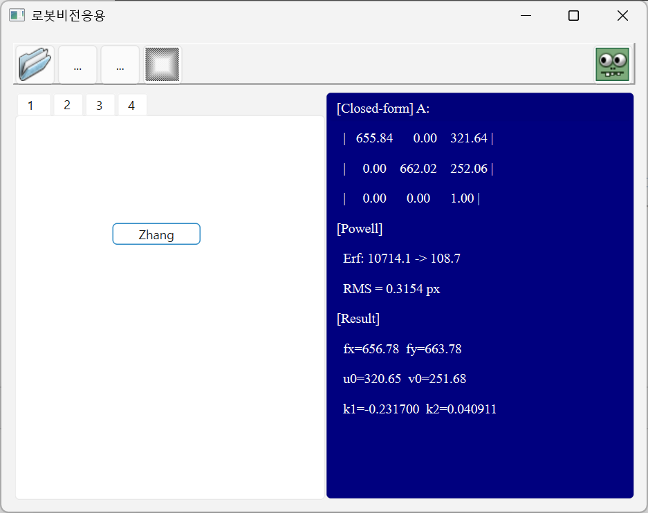
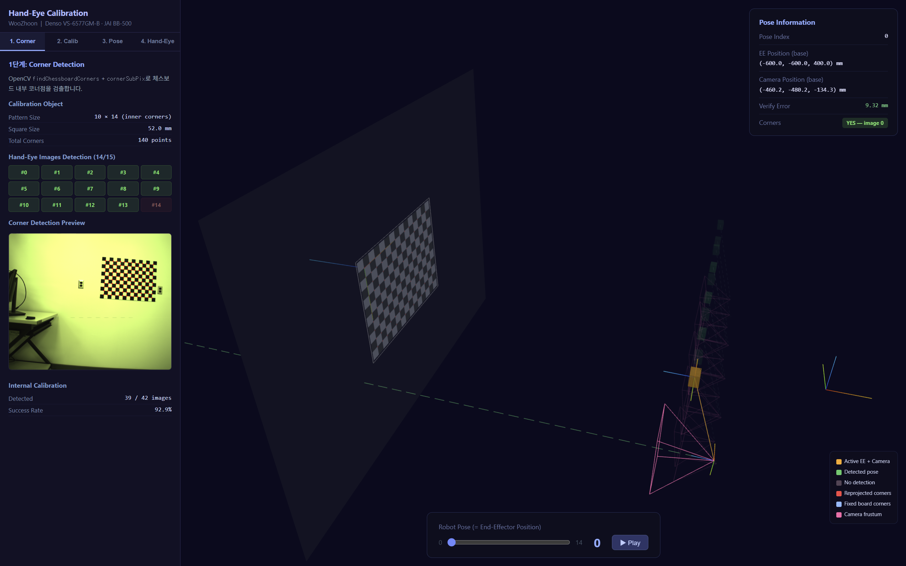
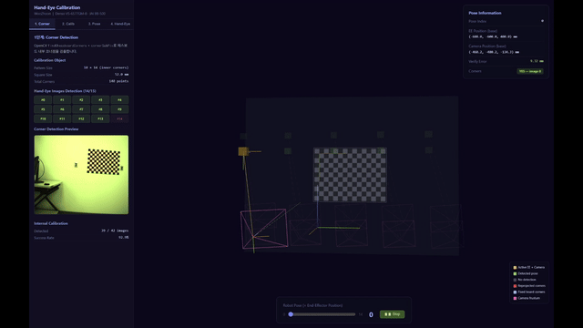
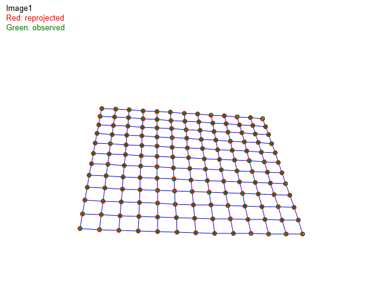
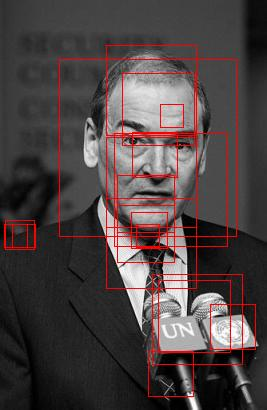
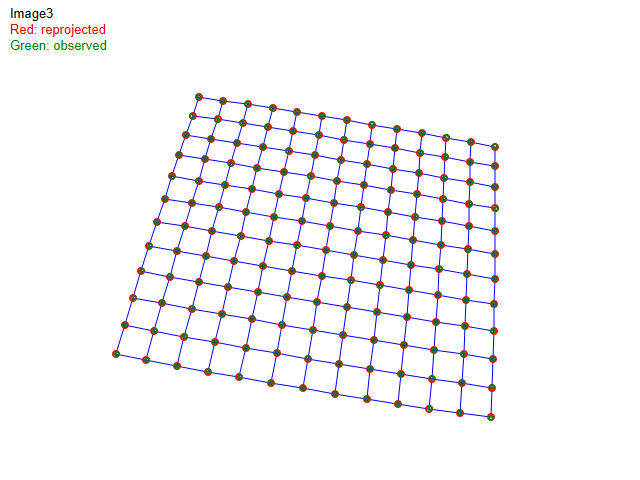

# Robot Vision Application

로봇비전응용 수업에서 진행한 프로젝트 모음.
이미지 분류부터 카메라 캘리브레이션, Hand-Eye Calibration, 3D 포인트클라우드까지 로봇 비전 파이프라인 전반을 C++/Python으로 직접 구현하였다.

`C++` `Qt 6` `Eigen` `Python` `OpenCV` `RealSense` `ROS`

> Framework code (UI scaffolding, image I/O)는 라이선스 문제로 제외하였으며, 핵심 알고리즘 구현부만 포함한다.

---

## Results at a Glance

| Face Detection (Viola-Jones) | | |
|:---:|:---:|:---:|
|  |  |  |

| AdaBoost Classifier | Camera Calibration | Hand-Eye Calibration |
|:---:|:---:|:---:|
|  |  |  |

| Hand-Eye 3D Visualization | |
|:---:|:---:|
|  |  |

---

## Modules

### 1. AdaBoost Coordinate Classifier

10차원 좌표 데이터에 대한 AdaBoost 이진 분류기. Decision stump weak classifier 200개를 순차 결합하여 **90.4% accuracy**를 달성하였다.

| Accuracy | Precision | Recall |
|:---:|:---:|:---:|
| **90.4%** | 92.1% | 88.4% |

[상세 문서](1-adaboost/README.md) · `classifierCoord.cpp/h`, `featureCoord.h`, `adaboostPipeline.cpp/h`

---

### 2. Face Detection (Viola-Jones)

Viola-Jones 논문 기반의 cascade classifier로 multi-scale 얼굴 검출을 수행한다. 162,336개 Haar-like feature, Integral Image, hard negative mining, per-window variance normalization, NMS를 포함한다.

| NMS Off | NMS On (n=3) |
|:---:|:---:|
|  |  |

| Precision | FPR | Detection Rate |
|:---:|:---:|:---:|
| **100%** | **0%** | 40% |

[상세 문서](2-face-detection/README.md) · `cascade_classifier.cpp/h`, `adaboost.cpp/h`, `detection_utils.cpp/h`

---

### 3. Camera Calibration (Zhang's Method)

Zhang(2000) 논문에 따른 카메라 캘리브레이션. 7장의 체커보드 이미지로부터 Homography 추정(DLT+SVD), closed-form 내부 파라미터 추출, Powell 비선형 최적화를 순차적으로 수행한다.

| | Closed-form | After Powell |
|---|:---:|:---:|
| fx | 655.84 | 656.78 |
| fy | 662.02 | 663.78 |
| **RMS** | — | **0.32 px** |

| | |
|:---:|:---:|
|  |  |

[상세 문서](3-camera-calibration/README.md) · `zhangCalibration.cpp/h`, `zhangVisualization.cpp/h`, `zhang_calibration.cpp/h`

---

### 4. Hand-Eye Calibration (AX=XB)

Denso 로봇 + JAI 카메라 시스템의 Hand-Eye Calibration. AX=XB(회전)와 AX=ZB(평행이동) formulation을 결합하고, LM 비선형 최적화로 정밀화한다. Three.js 기반 인터랙티브 3D 시각화를 포함한다.

[**Live Demo**](https://wzh-robotics.github.io/robot-vision-app/)

| 항목 | 값 |
|------|:---:|
| EE→카메라 거리 | **565.1 mm** |
| Avg verification error | **7.381** |

| 3D Visualization | Demo |
|:---:|:---:|
|  |  |

[상세 문서](4-hand-eye-calibration/README.md) · `handeye_calibration.cpp/h`, `pose_estimation.cpp/h`, `conventionalaxxbsvdsolver.cpp/h`

---

### 5. Point Cloud Interaction (Term Project)

Intel RealSense D435 기반 실시간 3D 포인트클라우드 뷰어. OpenCV + NumPy 소프트웨어 렌더러로 하드웨어 가속 없이 구현하였으며, ROS 연동을 통해 로봇 도달 시 포인트클라우드를 자동 캡처한다.

[상세 문서](5-pointcloud-interaction/README.md) · `pointcloud_viewer.py`

---

## Tech Stack

| Module | Language | Core Dependencies |
|--------|----------|-------------------|
| 1. AdaBoost | C++ | Qt 6.5, Eigen 3.4 |
| 2. Face Detection | C++ | Qt 6.5, Eigen 3.4 |
| 3. Camera Calibration | C++ | Qt 6.5, Eigen 3.4 |
| 4. Hand-Eye Calibration | C++ | Qt 6.5, Eigen 3.4, Three.js |
| 5. Point Cloud | Python | OpenCV, RealSense SDK, Open3D, ROS |

## Repository Structure

```
robot-vision-app/
├── 1-adaboost/                 # AdaBoost 이진 분류기
├── 2-face-detection/           # Viola-Jones 얼굴 검출
├── 3-camera-calibration/       # Zhang 카메라 캘리브레이션
├── 4-hand-eye-calibration/     # Hand-Eye Calibration (AX=XB)
└── 5-pointcloud-interaction/   # RealSense 3D 포인트클라우드 뷰어
```
